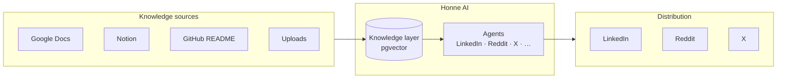
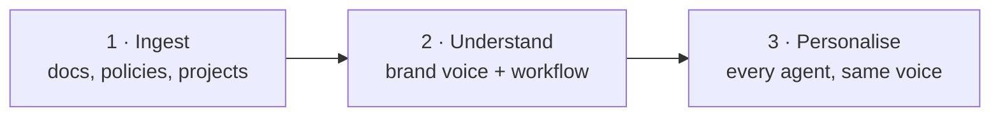
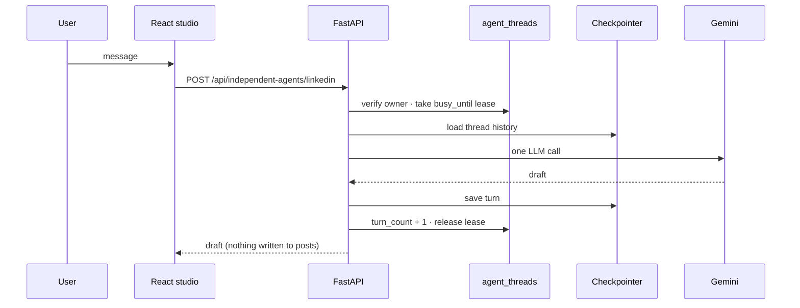
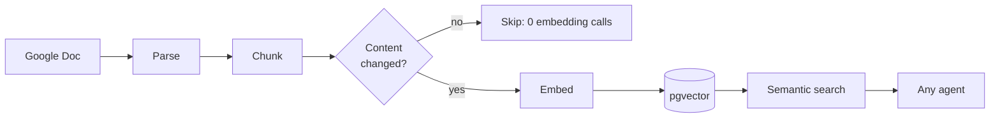
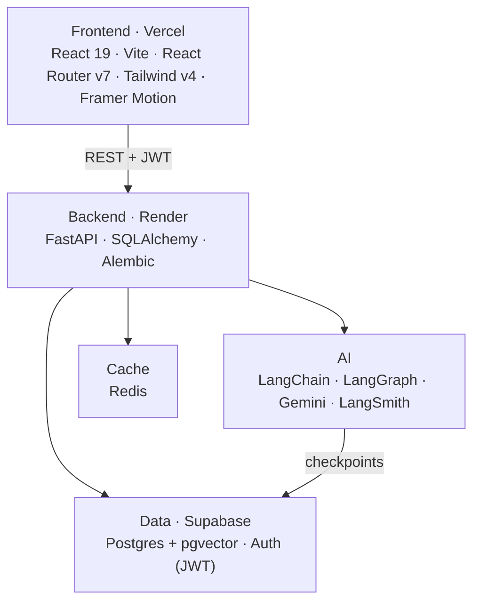

# Honne AI

Multiplayer AI for teams: one shared knowledge layer, many agents on top, and a single place to go from "I have the material" to "it's published". You can check it out [here!](#) <!-- 🔗 add live Vercel URL -->

<!-- 📸 HERO SCREENSHOT: /home dashboard, full width -->

## Table of Contents

- [Introduction](#introduction)
- [Features](#features)
- [Installation](#installation)
- [Technologies Used](#technologies-used)
- [Project Structure](#project-structure)
- [Contributing](#contributing)
- [License](#license)

## Introduction

Consumer AI is built for one person, one chat, one memory. Honne AI is built for teams: company knowledge is centralised, agents share it, and people and agents work alongside each other. It draws on **Dust** and **Jasper AI**.



Honne learns a company the way a new hire does: it takes in their material first, picks up the brand voice and workflow, and then works for them.



## Features

| Feature | What it does | Status |
|---|---|---|
| **Platform agents** | A LinkedIn, Reddit and X studio, each with its own agent and system prompt | ✅ Live |
| **Thread memory** | A chat resumes where it stopped, using a Postgres-backed LangGraph checkpointer | ✅ LinkedIn · ⏳ Reddit, X |
| **Turn-safe chats** | One turn at a time per thread (lease lock), a 15-turn cap and a 7-day idle purge | ✅ Live |
| **Supabase auth** | Email, Google sign-in and password reset, with JWT verification on the API | ✅ Live |
| **Knowledge layer** | Connect → parse → chunk → embed → store, with incremental re-embedding | 🚧 Next |
| **Semantic search** | One retrieval interface that every agent shares | 🚧 Next |
| **Supervisor graph** | One supervisor; researcher, angles, series and writer run as tools | 🗓 Later |

<!-- 📸 SCREENSHOT: LinkedIn studio mid-conversation -->
<!-- 📸 SCREENSHOT: Reddit / X studios side by side -->

**One chat turn**



**Where it's heading: ingestion pipeline**



<!-- 🖼 DIAGRAM: full system architecture (optional image export) -->

## Installation

To run Honne AI locally, follow these steps:

1. Clone the repository: `git clone https://github.com/Akashkarthik612/Content-Coach-AI.git`

2. Navigate to the project directory: `cd Content-Coach-AI`

3. Set up the backend (Python 3.12):
   ```bash
   python -m venv venv && source venv/bin/activate   # Windows: venv\Scripts\activate
   pip install -r requirements.txt -r requirements-test.txt
   cp .env.example .env                               # fill in Supabase, Gemini, Redis keys
   alembic upgrade head
   uvicorn backend.main:app --reload
   ```

4. Set up the frontend:
   ```bash
   cd frontend
   npm install
   npm run dev
   ```

5. Open your browser and visit [http://localhost:5173](http://localhost:5173)

**Tests:** `pytest tests/` (unit tests run anywhere; integration and smoke tests need `TEST_DATABASE_URL` pointing at a local pgvector Postgres) · `npm run test:smoke` in `frontend/` (Playwright).

## Technologies Used



- **React + Vite**: the landing page, auth flow and studio UI.
- **FastAPI**: async API, service-layer ownership checks and background purge tasks.
- **LangGraph**: agent graphs, with `AsyncPostgresSaver` for thread memory.
- **Google Gemini**: generation and embeddings.
- **Supabase**: Postgres with pgvector, and authentication.
- **GitHub Actions**: lint, backend tests, a Docker smoke test of the Render image, and a browser smoke test.

## Project Structure

```
├── backend/
│   ├── ai/
│   │   ├── independent_agents/   # LinkedIn, Reddit, X agents · thread memory · limits
│   │   └── agents/               # supervisor + workers (planned)
│   ├── auth/                     # Supabase JWT verification, user sync
│   ├── alembic/                  # database migrations
│   └── main.py                   # app startup, checkpointer, purge task
├── frontend/src/
│   ├── pages/                    # landing, auth, /home, studios
│   └── api/                      # API clients
├── tests/                        # unit · integration · smoke
└── scripts/prod_check.py         # post-deploy live check
```

## Contributing

This is a personal project and is under active development. Issues and suggestions are welcome; please open an issue before sending a pull request.

## License

<!-- 📄 add license (e.g. MIT) and a LICENSE file -->

---

Thank you for checking out Honne AI! If you have any questions or feedback, feel free to reach out.
